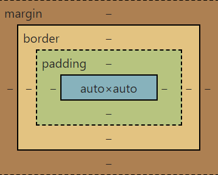

### 목차
- [선택자](#선택자)
- [텍스트 스타일](#텍스트-스타일)
- [배경 스타일](#배경-스타일)
- [레이아웃 스타일](#레이아웃-스타일)
- [반응형 웹](#반응형-웹)
- [플렉스 박스](#flexflexible-box-flexbox)


## CSS(Cascading Style Sheet)


- 웹 페이지의 표현(디자인)나타내는 언어

- 특정 요소를 선택해서 원하는 "스타일"rhk
"기능"을 적용시킬 수 있음

```css

selector(선택자){

    property(속성) : value(값);

}

```

## 스타일 적용 방법


### 내부 방식

1. 인라인 방식

```html

<tag style = "property : value;">

```

2. 내부 스타일

```html

<style>
    selector{
        property : value;
    }
</style>


```

### 외부 방식

3. 링크 방식

```html

<head>
    <link rel = "stylesheet" type = "text/css" href = "style.css">
</head>

```

```css

selector{
    property : value;
}

```

# 선택자

- [위로이동](#목차)

1. 전체 선택자 : *

- HTML 문서안에 모든 요소에 적용

2. 태그 선택자

- html 태그에 직접 효과 적용

- 해당 태그 작성 시 자동으로 효과 적용

3. 클래스 선택자

- 중복 가능

- .name {}

- <태그 class="name">

4. 아이디 선택자

- 중복불가

- #name{}

- <태그 id="name">


5. 그룹 선택자

- A, B, C {}

6. 자손 선택자

- A, B{}

7. 자식 선택자

- A > B {}

8. 속성 선택자

- 선택자[속성=속성값] : 일치

- 선택자[속성*=속성값] or 선택자[속성~=속성값]: 포함

- 선택자[속성^=속성값] or 선택자[속성|=속성값] : 시작값 일치

- 선택자[속성$=속성값] : 마지막 값 일치

9. 형제 선택자

- A + B : A 요소 뒤에 있는 B요소 "하나만" 선택

- A ~ B : A 요소 뒤에 있는 "모든" B요소 선택

10. 구조 선택자

- 웹 문서 구조를 기준으로 특정 위치에 있는 요소를 찾아 선택할 때 사용

- 선택자 : first-child : 첫번째 요소
- 선택자 : first-of-type : 첫번째 요소
- 선택자 : last-child : 마지막 요소
- 선택자 : last-of-type :  마지막 요소
- 선택자 : nth-child(n) : 앞에서 n번째 요소
- 선택자 : nth-of-type(n) : 앞에서 n번째 요소
- 선택자 : nth-last-child(n) : 뒤에서 n번째 요소
- 선택자 : nth-last-of-type(n) : 뒤에서 n번째 요소


11. 반응 선택자


- 사용자의 특정 동작에 따라 요소들을 선택할 때 사용

- :active : 사용자가 클릭하는 요소

- :hover : 사용자가 마우스를 올려놓은 요소

- :focus : 초점이 맞추어진 요소


12. 상태 선택자


- 웹 요소의 상태에 따라 요소들을 선택할 때 사용

- :checked : 체크된 상태의 요소

- :enabled : 사용 가능한 요소

- :disabled : 사용 불가능한 요소

## id와 class


- id : 현재 문서내에 "고유"한 값으로 "하나"만을 작성

- class : 현재 문서내에 "중복"된 값 작성 가능, "여러개" 작성 가능


## 선택자 우선 순위


1. 동일한 선택자를 사용하는 경우
    
    - 나중에 작성한 효과가 적용됨

    ```html
    <p>TEXT</p>
    ```

    ```css
    p{

        color: red;
        color: brown;
    }
    ```

2. 다른 방식의 선택자를 사용하는 경우


    - CSS 적용 우선순위
        : !important > 인라인 방식 > 아이디 선택자 > 클래스 선택자 > 태그 선택자


    ```html
    <p class="txt" id="title">TEXT</p>
     ```

    ```css
    #title {
            color: red;
    }

    .txt{
            color: blue;
    }

    p{
        color: green !important;
    }
    ```


## BEM (Block__Element--Modifier)

- 사용자 인터페이스를 독립된 블록으로 분리함으로써,
  복잡한 페이지에서도 간단하고 신속하게 개발을 수행하는 것이 목적

- 규칙 : 클래스 이름은 영소문자로 입력, 단어는 하이픈으로 연결

1. **block**
    - 클래스 이름은 '그것이 무엇인지', '어떤 목적으로 사용하는가'
        를 의미하는 이름이 적절

2. **Element**
    - Block의 이름을 상속받고, 언더스코어(_) 두 개를 입력 한 뒤
        Element 이름을 붙인다.

    - Block과 마찬가지로 '무언인지'를 의미하는 단어를 사용

3. **Modifier**

    - Block 혹은 Element의 모습이나 상태,움직임을 정의

    - 클래스 이름에서 형태, 기능, 역할을 유추

    - 확장하기 쉽게

```html
<ul class="menu">
        <li class="menu__item">항목1</li>
        <li class="menu__item menu__item--selected">항목2</li>
        <li class="menu__item">항목3</li>
</ul>
```

# 텍스트 스타일

- [위로 이동](#목차)


## font-family

- 웹 문서에서 사용할 글꼴을 지정하는 속성


```css
선택자{
    font-family : 글꼴명;
}
```

### 웹 폰트

- 구글 웹 폰트 : https://fonts.google.com


## font-size

- 글자의 크기를 지정하는 속성

```css
선택자{
    font-size: 크기(px|em|rem|%);
}
```

### 크기를 지정하는 단위

1. 절대크기

    - **px** : 모니터의 픽셀 단위로 크기를 계산

2. 상대크기

    - em : 부모 요소에서 지정한 폰트의 대문자 M의
        너비를 1em으로 계산
    
    - **rem** : 최상위 요소('html')에서 지정한 폰트의 대문자
        M의 너비를 1rem으로 계산    -> 모바일 기기에서 글자용도

    - % : 부모 요소의 크기에 대한 상대적인 비율로 계산 -> 모바일 기기에서 박스모델 용도


## font-weight

- 글자의 굵기를 조절하는 속성

```css

선택자{
    font-weight: 100~900 or normal or lighter or bold or bolder;
}

```

- 100~900 : 글자의 굵기를 세밀하게 조절

- normal : 기본값(400)

- lighter : 기본보다는 더 가늘게

- **bold** : 굵게

- bolder : 기본보다는 더 굵게


## font-style

- 글자를 이탤릭체로 표시하도록 지정하는 속성

```css
선택자{
    font style: normal or italic or oblique;
}
```
- italic : 글꼴에 디자인되어 있는 기울어진 글자를 사용
- oblique : 원래 글꼴을 기울어지게 표시

## font-variant

- 영어의 작은 대문자로 지정할 수 있는 속성

```css
font-variant : normal or small-caps;
```

- normal : 기본값으로 일반적인 형태로 표시

- small-caps : 작은 대문자로 표시하도록 지정


## font

- 글꼴 스타일 속성을 한 번에 지정할 수 있는 속성


```css
font : font-style font-variant font-weight font-size/line-height font-family;
```


## color

- 글자의 색을 지정하는 속성

- 색을 지정하는 방법은 **영문 색이름 표기법, 16진수 표기법**, 
    rgb/**rgba** 표기법, hsl/hsla 표기법이 있다. (a는 투명도)

```css
선택자{
    color: 색상;
}
```


## text-decoration

- 글자에 밑줄/윈선을 긋거나 취소선을 긋는 속성

```css
선택자{
    text-decoration: none or underline or overline or line_through;
}
```

- **none** : 글자의 선을 긋지 않는다.

- underline : 글자에 밑줄을 긋는다.

- overline : 글자 위에 선을 긋는다.

- line-through : 취소선을 긋는다.


## text-transform

- 영문자를 표시할 때, 대소문자를 원하는대로 바꿀 수 있는 속성

```css
선택자{
    text-transform : none or capitalize or uppercase or lowercase;
}
```

- none : 변환없이 표시

- capitalize : 시작하는 첫 번째 글자를 대문자로 변환

- uppercase : 모든 글자를 대문자로 변환

- lowercase : 모든 글자를 소문자로 변환


## text-shadow

1. 텍스트의 그림자를 지정

2. 여러 개 지정 가능(","로 구분)

```css
선택자{
    text-shadow: [dx] [dy] [blur] [color];
}
```

- dx : 그림자의 가로방향 거리를 지정한다. 
    (양수 값은 오른쪽,음수값은 왼쪽)

- dy : 그림자의 세로방향 거리를 지정.
    (양수 값은 아래쪽, 음수 값 위쪽)

- blur : 그림자의 숨겨짐 정도를 나타낸다.
    (양수로 지정하면 그림자가 모든방향으로 번지고,
     음수로 지정하면 그림자가 모든방향으로 축소)

- color : 그림자의 색상을 지정, 기본값은 현재 글자색이다.


## white-space

- 여러개의 공백을처리하는 방법을 지정하는 속성

```css
white-space : normal or nowrap or pre or pre-line or pre-wrap;
```

- normal : 여러 개의 공백을 하나로 표시 (기본값)

- nowrap : 여러 개의 공백을하나로 표시, 영역을 넘어가는 내용은 줄 바꾸지 않고 한 줄로 표시

- pre : 여러 개의 공백을 그대로 표시, 영역을 넘어가는 내용은 자동으로 주 바꿔서 표시

- pre-line : 여러 개의 공백을 하나로 표시, 영역을 넘어가는 내용은 자동으로
줄 바꿔 표시

- pre-wrap : 여러 개의 공백을 그대로 표시, 영역을 넘어가는 내용은 자동으로
줄 바꿔 표시


## letter-spacing

- 글자와 글자 사잉의 간격을 조정하는 속성

```css
선택자{
    letter-spacing: normal or 크기;
}

```

## word-spacing

- 단어와 단어 사이 간격을 조정하는 속성

```css
선택자{
    word-spacing : normal or 크기;
}
```

## text-align

- 문장을 정렬하는 속성

```css
    선택자{
        text-align: left or right, center or justify;
    }
```


## text-indent

-문장을 들여쓰기 하는 속성

```css
선택자{
    text-indent: 숫자(단위);
}
```

## line-height


- 문장의 줄 간격을 조정하는 속성

```css
선택자{
    line-height: normal or 숫자(단위);
}
```


## text-overflow

- 영역을 벗어나는 텍스트에 대한 상태를 지정하는 속성

```css
선택자{
    text-overflow: clip or ellipsis;
}
```

- clip : 영억을 넘어가는 텍스트를 자른다.

- ellipsis : 말 줄임으로 잘린 텍스트를 표시한다.


# 배경 스타일
[위로 이동](#목차)


## 색상 표현 방법


### 색상 이름 표기법


- 영문으로 색상 이름을 표시하는 방법

- 모든 브라우저에서 표현할 수 있는 색상을 웹 안전 색상(Web Safe Colors)

- 216가지


### 16진수 표기법


- #기호 다음에 6자리 16진수로 표시하는 방법

- 6자리는 앞에서부터 두 자리씩 묶어서 Red, Green, Blue로 표시

- #000000(검은색) ~ #ffffff(흰색)


### rgb/rgba 표기법

- rgb 표기법은 16진수 표기법과 다르게 10진수로 Red, Green, Blue를 표시

- rgba 표기법은 rgb에 불투명도 값을 추가로 지정 (0은 완전 투명, 1은 완전 불투명)

```css
rgb(red(0~255), green(0~255), blue(0~255));
rgba(red(0~255), green(0~255), blue(0~255), alpha(0~1));
```

### hsl/hsla 표기법

- hsl 표기법은 앞에서부터 색상(Hue), 채도(Saturation), 밝기(Brightness)

- hsla 표기법은 hsl에 불투명도 값을 추가로 지정(0은 완전 투명, 1은 완전 불투명)

- 색상(Hue)은 색상환으로 표시(0, 360 빨간색, 120 초록색, 240 파란색)

- 채도는 %로 표시(0%는 회색톤, 100%는 순색)

- 밝기는 %로 표시(0%는 가장 어둡고, 100%는 가장 밝다.)

```css
hsl(Hue(0~360), Saturation(0~100%), Brightness(0~100%));
hsla(Hue(0~360), Saturation(0~100%), Brightness(0~100%), alpha(0~1));
```

### background-color

- 배경색을 지정하는 속성

```css
선택자{
    background-color: 색상;
}
```

## background-clip

- 배경색의 범위를 지정하는 속성

```css
선택자{
    background-clip: border-box or padding-box or content-box;
}
```


- border-box : 테두리(border)까지 적용 (기본값)

- padding-box : 테두리를 뺀 패딩(padding) 범위까지 적용

- content-box : 내용(content) 부분에만 적용

## background-image

- 배경에 이미지를 설정하는 속성

```css
선택자{
    background-image: url('이미지주소');
}
```


## background-repeat

- 배경 이미지 반복 여부를 지정하는 속성

```css
선택자{
    background-repeat: repeat or repeat-x or repeat-y or no-repeat;
}
```

- repeat : 배경 이미지가 가득 찰 때까지 가로와 세로로 반복(기본값)

- repeate-x : 배경 이미지를 가로로 반복

- repeat-y : 배경 이미지를 세로로 반복

- **no-repeat** : 배경 이미지를 한 번만 출력하고 반복하지 않는다.


## background-size

- 배경 이미지 크기를 조절하는 속성

```css
선택자{
    background-size: auto or contain or cover or 크기 or 백분율;
}
```

- auto : 원래 배경 이미지 크기만크 표시(기본값)

- contain : 요소 안에 배경 이미지가 들어가도록 확대/축소

- **cover** : 요소를 배경 이미지가 모두 덮을 때까지 확대

- 크기 : 너비와 높이 값을 지정

- 백분율 : 요소의 크기를 기준으로 너비와 높이의 백분율 값을 지정


## background-position

- 배경 이미지가 표시되는 위치를 조정하는 속성

```css
선택자{
    background-position: 수평위치 수직위치;
}
```

- 수평 위치 : left, center, right, 크기값(px), 백분율로 표시

- 수직 위치 : top, center, bottom, 크기값(px), 백분율로 표시


## background-origin

- 배경 이미지를 배치할 때 기준을 지정하는 속성

```css
선택자{
    background-origin: border-box or padding-box or content-box;
}
```

- border-box : 테두리(border)가 기준

- padding-box : 테두리를 뺀 패딩(padding)이 기준(기본값)

- content-box : 내용(content)이 기준


## background-attachment

- 웹 페이지가 위아래도 움직여도 배경 이미지는 움직이지않고 고정하는 속성

```css
선택자{
    background-attachment: scroll or fixed;
}
```

- scroll : 화면 스크롤과 함께 배경 이미지도 스크롤(기본값) 

- **fixed** : 화면이 스크롤 되더라도 배경 이미지는 고정


## background

- 배경 스타일 속성을 한 번에 지정할 수 있는 속성

```css
선택자{
    background: image repeat attachment position clip origin size;
}
```


# 레이아웃 스타일

[위로이동](#목차)


## 박스 모델(Box Model)

- 모든 요소들은 사각형 박스로 표현되는데, 스타일 시트에서는 박스 형태인 요소를 박스 모델이라고 한다.


  

- CSS를 사용하면 박스 모델 요소의 크기, 위치, 속성을 변경할 수 있다.

- 박스 모델은 콘텐츠(Content) 영역과 테두리와 콘텐츠 영역 사이의 여백인 패딩(Padding), 박스모델 사이의 여백인 마진(Margin)으로 구성된다. 


## width, height

- 박스 모델에서 콘텐츠 영역의 크기를 지정할 때 사용

- width : 너비 지정

- height : 높이 지정

```css
선택자{
   width : 크기 or 백분율 or auto;
   height : 크기 or 백분율 or auto;
}
```

- 크기(px)나 백분율(%)로 지정

- auto : 박스 모델의 너비와 높이 값이 콘텐츠에 따라 자동 결정(기본값)


## display

- 블록 레벨 요소를 인라인 레벨 요소로 변경하거나 인라인 레벨 요소를 블록 레벨 요소로 변경할 수 있는 속성

```css
선택자{
    display: none or block or inline or inline-block or ...;
}
```

- none : 요소가 화면에서 표현되지 않고, 공간도 차지하지 않는다.

- block : 요소를 블록 레벨 요소로 변경

- inline : 요소를 인라인 레벨 요소로 변경

- inline-block : 요소를 인라인 레벨로 배치하면서 내용에는 블록 레벨 속성을 지정

- inline 요소는 margin, padding, height, width가 제대로 설정되지 않는다.


## padding, margin

- padding은 테두리와 콘텐츠 영역 사이의 여백

- margin은 요소와 요소 사이의 여백


```css
선택자{
    padding[-위치] : 크기 or 백분율 or auto;
    margin[-위치] : 크기 or 백분율 or auto;
}
```

- 위치 : top, right, left, bottom으로 지정

- 크기 : 크기(px), 백분율(%)로 지정

- auto : 콘텐츠에 따라 자동으로 결정(기본값)


## border-style

- 테두리 스타일을 지정하는 속성


```css
선택자{
    border-style: none or ..... or solid;
}
```


- none : 테두리가 나타나지 않는다. (기본값)

- dashed : 테두리를 짧은 선으로 표시

- dotted : 테두리를 점선으로 표시

- double : 테두리를 이중선으로 표시

- **solid** : 테두리를 실선으로 표시


## border-width

- 테두리의 두께를 지정하는 속성

```css
선택자 {
    border[-위치]-width : 크기 or thick or medium or thin;
}

```


## border-color

- 테두리의 색상을 지정하는 속성

```css
선택자{
    border[-위치]-color: 색상;
}
```


## border

- 테두리의 두께, 스타일, 색상을 한 번에 지정하는 속성

```css
선택자{
    border: 두께 스타일 색상;
}
```


## border-radius

- 테두리의 모서리를 둥글게 지정하는 속성

- 테두리 모서리의 두 방향과 반지름 값을 사용해서 표기

```css
선택자{
    border[-위치-위치]-radius : 크기 or 백분율;
}
```

## 포지셔닝

- CSS를 이용해서 여러 요소를 원하는 위치에 적절하게 배치하는 것

## box-sizing

- 요소의 너비와 높이의 기준을 지정하는 속성

```css
선택자{
    box-sizing: content-box or border-box;
}
```

- content-box : 요소의 너비와 높이를 콘테츠를 기준으로 지정(기본값)

- border-box : 요소의 너비와 높이를 테두리를 기준으로 지정


## float, clear

- float 속성은 요소의 위치를 왼쪽이나 오른쪽으로 배치하는 속성

```css
선택자{
    float: left or right or none;
}
```

- left : 요소를 왼쪽에 배치

- right : 요소를 오른쪽에 배치

- none : 요소를 어느 쪽으로도 배치하지 않는다.

* float 속성을 사용해 요소를 배치하면 다음 요소에 영향을 미치는데 이를 초기화시키는 속성이 clear 속성

```css
선택자{
    clear : left or right or none or both;
}
```


## position

- 웹 문서 안에서 요소들을 자유롭게 배치하는 속성

```css
선택자{
    position: static or relative or absolute or fixed;
}
```

- static : 문서의 흐름에 맞추어 요소를 배치(기본값)

- **relative** : 이전 요소에 연결해 배치하면서 위치를 지정하여 요소를 배치

- **absulute** : 원하는 위치를 지정하여 요소를 배치

- **fixed** : 지정한 위치에 고정하여 요소를 배치

- 속성값이 static을 제외한 나머지들은 좌표를 이용해서 요소의 위치를 조절할 수 있다.

- 위치는 top, bottom, left, right로 지정할 수 있다.


## visibility

- 요소를 화면에 보이거나 보이지 않게 하는 속성


```css
선택자{
    visibility: visible or hidden of collapse;
}
```

- visible : 요소를 표시(기본값)

- **hidden** : 요소를 감춘다. 단, 크기는 유지하기 때문에 공간은 차지한다.

- collapse : 표의 행, 열, 행 그룹 등에서 지정하면 서로 겹치도록 지정한다.
그 외에 영역에서 사용하면 hidden처럼 처리된다.


## z-index

- 요소 위에 요소를 쌓을 때 쌓는 순서를 지정하는 속성

- 요소에 z-index 값이 클수록 위에 쌓인다.

- 무조건 맨 위에 표시해야 하는 경우 큰 값으로 지정하기도 한다.

```css
선택자{
    z-index: 값;
}
```


br

[위로이동](#목차)

# 반응형 웹

- 구간 별 페이지 제작 : pc, tablet, mobile
- viewport : 스마트폰 화면에서 실제 내용이 표시되는 영역

```html
<meta name="viewport" content = "속성1=값1, 속성2=값2,...">
```

- width : 뷰포트의 너비 (device-width or 크기)

- height : 뷰포트 높이(device-height or 크기)

- user-scalable : 확대/축소 가능 여부(yes or no, yes : 기본값)

- initial-scale : 초기 확대/축소 값(1 ~ 10, 1 : 기본값)

- minimum-scale : 최소 확대/축소 값(0 ~ 10, 0.25 : 기본값)

- maximum-scale : 최대 확대/축소 값(0 ~ 10, 1.6 : 기본값)

## 미디어 쿼리(Media Queries)


- 사이트에 접속하는 장치에 따라 특정한 CSS 스타일을 적용

```css
@media 미디어 유형 [and 조건] ... {
    ...
}


@media screen and (min-width: 200px) and (max-width: 360px) {  /*이 방법 추천 안함*/
    ...
}

@media screen and(min-width: 700px){

}
```


<br>

[위로 이동](#목차)

# Flex(Flexible Box, Flexbox)

- CSS 레이아웃 모델로 화면 크기에 따라 레이아웃의 배치나 크기를 조절할 때 편리하게 사용


```html
<div class="container">
    <div class="item"></div>
    <div class="item"></div>
    <div class="item"></div>
</div>
```


## display: flex;

- Flex 컨테이너에 display:flex;를 적용하면서 시작


```css
.container{
    display: flex;
}
```


## flex-direction

- 배치 방향 설정

- 아이템들이 배치되는 메인 축의 방향을 결정하는 속성


```css
.container{
    flex-direction: row or column or row-reverse or column-reverse;
}
```

- row : 왼쪽부터 순차적으로 배치(기본값)

- row-reverse : 오른쪽으로부터 순차적으로 배치

- column : 위에서 아래로 순차적으로 배치

- column-reverse : 아래에서 위로 순차적으로 배치


## flex-wrap

- 아이템 줄 바꿈을 어떻게 할지 결정하는 속성

```css
.container{
    flex-wrap: nowrap or wrap or wrap-reverse;
}
```

- nowrap : 줄 바꿈을 하지 않음(기본값)

- wrap : 줄 바꿈

- wrap-reverse : 역순으로 배치 후 줄 바꿈


## flex-flow

- flex-direction과 flex-wrap을 한꺼번에 지정할 수 있는 단축 속성

```css
.container{
    flex-flow: row wrap;

    flex-direction: row;
    flex-wrap: wrap;
}
```


## justify-content

- 메인 축 방향으로 정렬

```css
.container{
    justify-content: flex-start or flex-end or center or space-between or space-around or space-evenly;
}
```

- flex-start : 아이템들을 시작점으로 정렬(기본값)

- flex-end : 아이템들을 끝점으로 정렬

- center : 아이템들을 가운데로 정렬

- space-between : 아이템들 사이에 균일한 간격 생성

- space-around : 각 아이템들의 좌/우에 균일한 간격 생성

- space-evenly : 아이템들의 사이와 양 끝에 균일한 간격 생성(*지원하지 않는 브라우저가 있음)


### align-items

- 수직 축 방향으로 정렬

```css
.container{
    align-items: stretch or flex-start or flex-end or center or baseline;
}
```

- stretch : 아이템들을 위아래 방향으로 끝까지 늘림(기본값)

- flex-start : 아이템들을 위쪽으로 정렬

- flex-end : 아이템들을 아래쪽으로 정렬

- center : 아이템들을 중간 정렬

- baseline : 아이템들을 텍스트 베이스 라인으로 정렬


## align-content

- 여러 행 정렬

- flex-wrap : wrap;이 설정된 상태에서, 아이템들의 행이 2줄 이상인경우 수직 축 방향으로 정렬을 결정하는 속성

```css
.container{
    align-content : stretch or flex-start or flex-end or center or space-between or space-around or space-evenly;
}
```


## flex-basis

- flex 아이템의 기본 크기 설정(flex-direction이 row일 때는 너비, column일 때는 높이)


```css
.item{
    flex-basis: auto or 0 or 크기;
}
```

## flex-grow

- flex-basis의 값보다 커질 수 있는지를 결정하는 속성

```css
.item{
    flex-grow: 0 or 숫자;
}
```


## flex-shrink

- flex-grow와 한 쌍을 이루는 속성으로, flex-basis 값보다 작아질 수 있는지를 결정하는 속성이다.

```css
.item{
    flex-shrink: 1 or 숫자;
}
```


## flex

- flex-grow, flex-shrink, flex-basis를 한 번에 쓸 수 있는 단축 속성

```css
.item{
    flex: 1; /* flex-grow: 1, flex-shrink: 1, flex-basis: 0; */
    flex: 1 1 auto; /* flex-grow: 1, flex-shrink: 1, flex-basis: auto; */
    flex: 1 500px; /* flex-grow: 1, flex-shrink: 1, flex-basis: 500px; */
}
```


## align-self

- 특정 아이템만 정렬을 따로 정렬하고자 할 때 사용하는 속성


```css
.item{
    align-self: flex-start or flex-end or center or baseline or stretch;
}
```


## order

- item들의 순서를 바꿀 수 있는 속성

```css
order: 0 or 숫자;
```